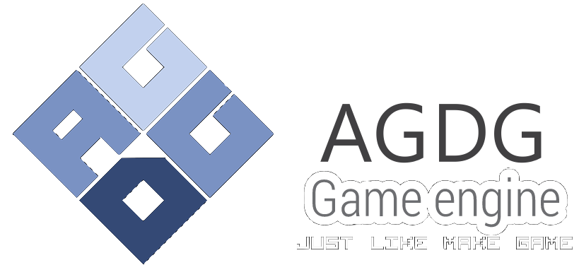

# AGDG Engine

  

## 2D and 3D cross-platform game engine

**[AGDG Engine](https://godotengine.org) is a feature-packed, cross-platform
game engine to create 2D and 3D games from a unified interface.** It provides a
comprehensive set of [common tools](https://godotengine.org/features), so that users can focus on making games
without having to reinvent the wheel. Games can be exported with one click to a
number of platforms, including the major desktop platforms (Linux, macOS,
Windows), mobile platforms (Android, iOS), as well as Web-based platforms
and [consoles](https://docs.godotengine.org/en/latest/tutorials/platform/consoles.html).

## Free, open source and community-driven

AGDG Engine is completely free and open source under the very permissive [MIT license](https://godotengine.org/license).
No strings attached, no royalties, nothing. The users' games are theirs, down
to the last line of engine code.

